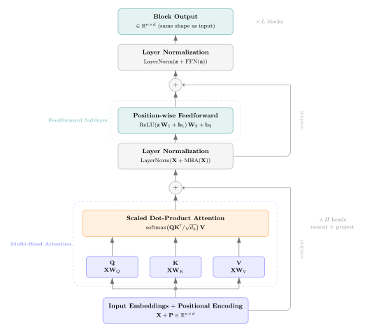

# L13a: Transformers and Self-Attention
In this lecture, we explore the _self-attention_ mechanism and the _transformer block_, the architectural building blocks of modern transformer models. Self-attention generalizes the modern Hopfield update rule from L6c by introducing learnable query, key, and value projections, running multiple attention heads in parallel, and adding positional information, producing an architecture that processes all positions of a sequence at once.

> __Learning Objectives:__
>
> By the end of this lecture, you should be able to:
>
> * __Connect modern Hopfield networks to self-attention:__ Explain how scaled dot-product self-attention generalizes the modern Hopfield update rule from L6c by replacing the shared memory matrix with three learnable linear projections (queries, keys, values).
> * __Apply scaled dot-product and multi-head attention equations:__ Use the self-attention equations to compute outputs for a sequence of input embeddings, and compute the total parameter count of a single transformer block.
> * __Compare transformers to recurrent architectures:__ Identify when self-attention is preferred over an LSTM or Elman RNN based on parallelism, sequence length, and the range of dependencies the model needs to capture.

Let's get started!
___

## Examples
Today, we will use the following notebooks to illustrate key concepts:

> [▶ Self-Attention for Sentiment Classification](CHEME-5820-L13a-Example-Attention-Sentiment-Spring-2026.ipynb). In this example, we replace the mean-pooled bag-of-embeddings classifier from the [L10b lab](https://github.com/varnerlab/CHEME-5820-Labs-Spring-2026) with a single self-attention layer over the same QuantumBrew product reviews. We visualize the learned attention weights on adversarial examples (sarcasm, double negation) where mean-pooling fails.
>
> [▶ Advanced: Two Derivations for Self-Attention](CHEME-5820-L13a-Advanced-Attention-Derivations-Spring-2026.ipynb). In this notebook, we derive (a) the $1/\sqrt{d_{k}}$ scaling factor in scaled dot-product attention from a variance argument and (b) the permutation equivariance of self-attention, which formally motivates the need for positional encodings.

___

## Recall
Self-attention sits at the intersection of two earlier topics in this course: recurrent neural networks and modern Hopfield networks. 

### Recurrent Networks
In the [L12a lecture on Recurrent Neural Networks](../../week-12/L12a/CHEME-5820-L12a-Lecture-RecurrentNetworks-Spring-2026.ipynb) and the [L12c lecture on LSTMs](../../week-12/L12c/CHEME-5820-L12c-Lecture-LSTM-Spring-2026.ipynb), we saw that recurrent networks process a sequence one element at a time. The hidden state at time $t$ depends on the hidden state at time $t-1$, which depends on the hidden state at time $t-2$, and so on. This creates two practical problems:

> __Limitations of recurrent processing__
>
> * __No parallelism across time:__ The hidden states $\mathbf{h}_{1}, \mathbf{h}_{2}, \ldots, \mathbf{h}_{T}$ must be computed sequentially because each one depends on its predecessor. This prevents the GPU from processing all positions of a sequence at once, which becomes a serious throughput bottleneck for long sequences.
> * __Information must pass through every intermediate step:__ For information at time $t_{1}$ to influence the output at a much later time $t_{2}\gg t_{1}$, that information has to be carried through the hidden state across every intervening step. Even with LSTM gating mechanisms, the model must learn to preserve and transport information across many time steps.

We need an architecture in which every position of a sequence can interact with every other position directly, in a single computation, with no recurrence and no sequential bottleneck.

### Attention as Modern Hopfield
In the [L6c lecture on Modern Hopfield Networks](../../week-6/L6c/CHEME-5820-L6c-Lecture-Modern-HopfieldNetworks-Spring-2026.ipynb), we showed that the modern Hopfield retrieval rule of [Ramsauer et al. (2020)](https://arxiv.org/abs/2008.02217) is mathematically equivalent to single-head attention. Recall the update rule:

> __Modern Hopfield Update Rule (recap from L6c)__
>
> Let $\mathbf{X}\in\mathbb{R}^{N\times K}$ be a memory matrix containing $K$ stored memories as columns, and let $\mathbf{s}\in\mathbb{R}^{N}$ be a query state. The modern Hopfield retrieval rule maps the query $\mathbf{s}$ to a retrieved memory $\mathbf{T}(\mathbf{s})$ via:
> $$
\boxed{
\mathbf{T}(\mathbf{s}) = \mathbf{X}\,\operatorname{softmax}\!\left(\beta\,\mathbf{X}^{\top}\mathbf{s}\right)
}
> $$
> where $\beta > 0$ is the inverse temperature controlling how sharply the softmax selects a single memory. The intuition is _content-addressable retrieval_: the query $\mathbf{s}$ is compared against every stored memory by inner product, the comparisons are passed through a softmax to produce a weight vector over memories, and the retrieved memory is the softmax-weighted average of the stored memories.

Self-attention takes this rule and makes three changes that turn it into a learnable, parallelizable layer:

> __From Modern Hopfield to Self-Attention__
>
> * __Three learnable projections instead of one shared $\mathbf{X}$:__ Modern Hopfield uses the same matrix $\mathbf{X}$ for both the comparison ($\mathbf{X}^{\top}\mathbf{s}$) and the retrieval ($\mathbf{X}\,\cdot$). Self-attention separates these by introducing three learnable projection matrices $\mathbf{W}_{Q}$, $\mathbf{W}_{K}$, $\mathbf{W}_{V}$ that produce queries $\mathbf{Q}$, keys $\mathbf{K}$, and values $\mathbf{V}$. Comparisons are done with $\mathbf{Q}\mathbf{K}^{\top}$, and the retrieval combines the value rows.
> * __Multiple heads in parallel:__ A single attention computation can only "look up" one type of pattern at a time. Self-attention uses $H$ parallel _attention heads_, each with its own $(\mathbf{W}_{Q}, \mathbf{W}_{K}, \mathbf{W}_{V})$ projections, so the model can look up several kinds of relationships simultaneously.
> * __Positional information added explicitly:__ The Hopfield rule has no notion of order: it treats memories as an unordered set. Self-attention has the same property, which we prove formally in the [advanced notebook](CHEME-5820-L13a-Advanced-Attention-Derivations-Spring-2026.ipynb). For sequence modeling we restore order by adding _positional encodings_ to the input embeddings.

The transformer block, introduced in [Vaswani et al. (2017) "Attention is All You Need"](https://arxiv.org/abs/1706.03762), assembles these pieces into a single building block that can be stacked to form transformer models like BERT and GPT.

___

The figure below shows the structure of a single transformer block. We build up each component in the following sections, starting with scaled dot-product self-attention, then multi-head attention, positional encoding, and finally the full block with residual connections and layer normalization.

    

      
    

## Scaled Dot-Product Self-Attention
Let the input to the self-attention layer be a sequence of $n$ token embeddings stacked into a matrix $\mathbf{X}\in\mathbb{R}^{n\times d}$, where $n$ is the sequence length and $d$ is the embedding dimension. Each row $\mathbf{x}_{i}\in\mathbb{R}^{d}$ is the embedding of one token.

The layer first projects $\mathbf{X}$ into three new matrices: queries $\mathbf{Q}$, keys $\mathbf{K}$, and values $\mathbf{V}$.

> __Scaled Dot-Product Self-Attention__
>
> Let the input be $\mathbf{X}\in\mathbb{R}^{n\times d}$. Define three learnable projection matrices:
> * $\mathbf{W}_{Q}\in\mathbb{R}^{d\times d_{k}}$ projects the input to queries
> * $\mathbf{W}_{K}\in\mathbb{R}^{d\times d_{k}}$ projects the input to keys
> * $\mathbf{W}_{V}\in\mathbb{R}^{d\times d_{v}}$ projects the input to values
>
> The queries, keys, and values are computed as:
> $$
\boxed{
\begin{align*}
\mathbf{Q} &= \mathbf{X}\,\mathbf{W}_{Q} \in \mathbb{R}^{n\times d_{k}} \\
\mathbf{K} &= \mathbf{X}\,\mathbf{W}_{K} \in \mathbb{R}^{n\times d_{k}} \\
\mathbf{V} &= \mathbf{X}\,\mathbf{W}_{V} \in \mathbb{R}^{n\times d_{v}}
\end{align*}}
> $$
> The output of the self-attention layer is:
> $$
\boxed{
\operatorname{Attention}(\mathbf{Q},\mathbf{K},\mathbf{V}) = \operatorname{softmax}\!\left(\frac{\mathbf{Q}\mathbf{K}^{\top}}{\sqrt{d_{k}}}\right)\mathbf{V} \in \mathbb{R}^{n\times d_{v}}
}
> $$
> where the softmax is applied row-wise, so each row of $\mathbf{Q}\mathbf{K}^{\top}/\sqrt{d_{k}}$ is independently normalized to sum to one. Note: we follow the original [Vaswani et al. (2017)](https://arxiv.org/abs/1706.03762) formulation, which uses bias-free projections. Some implementations add bias terms to the projections, but the standard convention omits them.

There are three things worth pausing on in this equation.

> __Reading the equation piece by piece__
>
> * __The $\mathbf{Q}\mathbf{K}^{\top}\in\mathbb{R}^{n\times n}$ is a similarity matrix:__ entry $(i,j)$ is the inner product $\langle\mathbf{q}_{i},\mathbf{k}_{j}\rangle$, which measures how much query $i$ is interested in key $j$. The matrix has one row per query and one column per key, so it has shape $n\times n$ regardless of the embedding dimension.
> * __The $1/\sqrt{d_{k}}$ scaling stabilizes the softmax:__ if the entries of $\mathbf{q}_{i}$ and $\mathbf{k}_{j}$ are independent with mean zero and unit variance, the inner product $\langle\mathbf{q}_{i},\mathbf{k}_{j}\rangle$ has variance $d_{k}$. Dividing by $\sqrt{d_{k}}$ keeps the inputs to the softmax in a regime where gradients do not vanish. We derive this in the [advanced notebook](CHEME-5820-L13a-Advanced-Attention-Derivations-Spring-2026.ipynb).
> * __Multiplying by $\mathbf{V}$ produces a weighted average of value rows:__ row $i$ of the output is $\sum_{j=1}^{n}\alpha_{ij}\mathbf{v}_{j}$, where $\alpha_{ij}$ is the $(i,j)$ entry of the softmax matrix. So output row $i$ is the attention-weighted combination of value rows for query $\mathbf{q}_{i}$.

How many parameters are in a single self-attention layer?

> __Parameter Count: Single-Head Self-Attention__
>
> The self-attention layer has three weight matrices:
> * $\mathbf{W}_{Q}\in\mathbb{R}^{d\times d_{k}}$ contributes $d\,d_{k}$ parameters
> * $\mathbf{W}_{K}\in\mathbb{R}^{d\times d_{k}}$ contributes $d\,d_{k}$ parameters
> * $\mathbf{W}_{V}\in\mathbb{R}^{d\times d_{v}}$ contributes $d\,d_{v}$ parameters
>
> The total parameter count is:
> $$
\begin{align*}
N_{\text{single-head}} = 2\,d\,d_{k} + d\,d_{v}\quad\blacksquare
\end{align*}
> $$
> The parameter count is independent of the sequence length $n$. The same weight matrices are reused for every position in the sequence, exactly the way RNN weights are reused across time steps.

___

## Multi-Head Attention
A single attention computation can only express one kind of relationship between tokens. _Multi-head attention_ runs $H$ self-attention layers in parallel, each with its own projection matrices, and concatenates their outputs. This lets the model attend to several types of relationships at the same time, for example one head might track syntactic agreement while another tracks semantic similarity.

> __Multi-Head Self-Attention__
>
> Let $\mathbf{X}\in\mathbb{R}^{n\times d}$ be the input and let $H$ be the number of attention heads. For each head $h = 1, 2, \ldots, H$, define learnable projection matrices:
> * $\mathbf{W}_{Q}^{(h)}\in\mathbb{R}^{d\times d_{k}}$ projects the input to queries for head $h$
> * $\mathbf{W}_{K}^{(h)}\in\mathbb{R}^{d\times d_{k}}$ projects the input to keys for head $h$
> * $\mathbf{W}_{V}^{(h)}\in\mathbb{R}^{d\times d_{v}}$ projects the input to values for head $h$
>
> Compute the output of each head as a single self-attention layer:
> $$
\boxed{
\operatorname{head}_{h} = \operatorname{Attention}\!\left(\mathbf{X}\mathbf{W}_{Q}^{(h)},\,\mathbf{X}\mathbf{W}_{K}^{(h)},\,\mathbf{X}\mathbf{W}_{V}^{(h)}\right) \in \mathbb{R}^{n\times d_{v}}
}
> $$
> Concatenate the head outputs along the column dimension and project back to the model dimension $d$ with a learnable output matrix $\mathbf{W}_{O}\in\mathbb{R}^{H d_{v}\times d}$:
> $$
\boxed{
\operatorname{MultiHead}(\mathbf{X}) = \left[\operatorname{head}_{1}\,\Vert\,\operatorname{head}_{2}\,\Vert\,\cdots\,\Vert\,\operatorname{head}_{H}\right]\mathbf{W}_{O} \in \mathbb{R}^{n\times d}
}
> $$
> where $[\,\cdot\,\Vert\,\cdot\,]$ denotes column-wise concatenation.

In practice, $d_{k}$ and $d_{v}$ are usually set so that $H d_{v} = d$, which means the output of the concatenation already has the right shape and the projection $\mathbf{W}_{O}$ is square. With this convention, $d_{k} = d_{v} = d/H$.

> __Parameter Count: Multi-Head Self-Attention__
>
> Each head has $2 d d_{k} + d d_{v}$ parameters from the $(\mathbf{W}_{Q},\mathbf{W}_{K},\mathbf{W}_{V})$ projections, and there are $H$ heads, so the head projections together contribute $H(2 d d_{k} + d d_{v})$ parameters. The output projection $\mathbf{W}_{O}$ adds $H d_{v}\,d$ parameters.
>
> The total parameter count is:
> $$
\begin{align*}
N_{\text{multi-head}} &= H\,(2\,d\,d_{k} + d\,d_{v}) + H\,d_{v}\,d \\
&= 2\,H\,d\,d_{k} + 2\,H\,d\,d_{v}\quad\blacksquare
\end{align*}
> $$
> When $d_{k} = d_{v} = d/H$, this simplifies to $N_{\text{multi-head}} = 4 d^{2}$ parameters total, a constant in $H$ that depends only on the model dimension $d$.

___

## Positional Encoding
Self-attention treats the input $\mathbf{X}$ as an unordered set of token embeddings. To see why, observe that if we permute the rows of $\mathbf{X}$ (that is, reorder the tokens), the rows of the output $\operatorname{Attention}(\mathbf{X})$ are permuted in the same way, but the contents of each row do not change. Self-attention is _permutation equivariant_. We prove this formally in the [advanced notebook](CHEME-5820-L13a-Advanced-Attention-Derivations-Spring-2026.ipynb).

This is a problem for sequence modeling, because the meaning of a sentence depends on word order. We restore order by adding a _positional encoding_ to each token embedding before it enters the attention layer.

> __Sinusoidal Positional Encoding__
>
> For position $p\in\{0, 1, 2, \ldots, n-1\}$ and embedding dimension index $i\in\{0, 1, 2, \ldots, d-1\}$, the sinusoidal positional encoding of [Vaswani et al. (2017)](https://arxiv.org/abs/1706.03762) is defined component-wise as:
> $$
\boxed{
\begin{align*}
\operatorname{PE}(p,\,2k)   &= \sin\!\left(\frac{p}{10000^{\,2k/d}}\right) \\
\operatorname{PE}(p,\,2k+1) &= \cos\!\left(\frac{p}{10000^{\,2k/d}}\right)
\end{align*}}
> $$
> for $k = 0, 1, 2, \ldots, \lfloor d/2\rfloor - 1$. Even-indexed dimensions use sine, odd-indexed dimensions use cosine, and the wavelength of each pair grows geometrically from $2\pi$ to $10000\cdot 2\pi$ across the dimension index.
>
> The positional encoding is added to the input embedding _element-wise_:
> $$
\tilde{\mathbf{x}}_{p} = \mathbf{x}_{p} + \operatorname{PE}(p,\,\cdot)
> $$
> The augmented embedding $\tilde{\mathbf{x}}_{p}$ is then passed to the self-attention layer in place of $\mathbf{x}_{p}$.

The sinusoidal encoding has two convenient properties: it has no learnable parameters, so it can be precomputed once for any sequence length, and the encoding for position $p+k$ can be expressed as a linear function of the encoding for position $p$, which lets the attention layer learn relative-position relationships. In practice, modern transformers often use _learned_ positional encodings (a separate $n_{\max}\times d$ embedding table) or _rotary_ positional encodings (RoPE). All of these approaches share the same goal: inject position information so that the otherwise permutation-equivariant self-attention layer can distinguish the order of the tokens.

___

## The Transformer Block
A single _transformer block_ wraps multi-head attention with two engineering refinements: a residual connection plus layer normalization around the attention sublayer, and a position-wise feedforward sublayer that gives each token its own nonlinear transformation. The block is then stacked $L$ times to form a complete transformer.

### Layer Normalization
We have not formally introduced layer normalization in this course, so a brief definition:

> __Layer Normalization__
>
> Given a vector $\mathbf{z}\in\mathbb{R}^{d}$, layer normalization rescales $\mathbf{z}$ to have zero mean and unit variance across its components, then applies a learnable per-component affine transformation:
> $$
\operatorname{LayerNorm}(\mathbf{z}) = \boldsymbol{\gamma}\odot\frac{\mathbf{z} - \mu(\mathbf{z})}{\sqrt{\sigma^{2}(\mathbf{z}) + \epsilon}} + \boldsymbol{\beta}
> $$
> where $\mu(\mathbf{z}) = \tfrac{1}{d}\sum_{i=1}^{d}z_{i}$ is the per-vector mean, $\sigma^{2}(\mathbf{z}) = \tfrac{1}{d}\sum_{i=1}^{d}(z_{i} - \mu(\mathbf{z}))^{2}$ is the per-vector variance, $\boldsymbol{\gamma},\boldsymbol{\beta}\in\mathbb{R}^{d}$ are learnable per-component scale and shift parameters, $\odot$ is the element-wise product, and $\epsilon > 0$ is a small constant for numerical stability.
>
> Layer normalization is applied to each token embedding independently, so it normalizes across the embedding dimension and not across the batch or sequence dimensions. This makes it robust to changes in batch size and sequence length, which is why it is the default normalization choice in transformers.

### Block Equations

> __Transformer Block (Pre-Norm Variant)__
>
> Let $\mathbf{X}\in\mathbb{R}^{n\times d}$ be the input to the block. The block computes:
> $$
\boxed{
\begin{align*}
\mathbf{Y} &= \mathbf{X} + \operatorname{MultiHead}(\operatorname{LayerNorm}(\mathbf{X})) \\
\mathbf{Z} &= \mathbf{Y} + \operatorname{FFN}(\operatorname{LayerNorm}(\mathbf{Y}))
\end{align*}}
> $$
> where the position-wise feedforward sublayer applies the same two-layer MLP to every row of its input independently:
> $$
\operatorname{FFN}(\mathbf{u}) = \sigma\!\left(\mathbf{u}\,\mathbf{W}_{1} + \mathbf{b}_{1}\right)\mathbf{W}_{2} + \mathbf{b}_{2}
> $$
> with $\mathbf{W}_{1}\in\mathbb{R}^{d\times d_{ff}}$, $\mathbf{W}_{2}\in\mathbb{R}^{d_{ff}\times d}$, biases $\mathbf{b}_{1}\in\mathbb{R}^{d_{ff}}$ and $\mathbf{b}_{2}\in\mathbb{R}^{d}$, and a nonlinearity $\sigma$ such as ReLU or GELU. The hidden dimension $d_{ff}$ is typically chosen as $4d$. Here $\mathbf{u}\in\mathbb{R}^{d}$ is a single row (token embedding), following the same row-vector convention used for the attention equations above.

The residual connection $\mathbf{X} + (\cdot)$ around each sublayer provides a direct path for gradients to flow backward through the block, similar in spirit to the LSTM cell state, though without the learned gating that controls what information to preserve or overwrite. This direct gradient path is what makes deep stacks of transformer blocks trainable.

### Parameter Count of One Transformer Block

> __Parameter Count: Single Transformer Block__
>
> A single transformer block with model dimension $d$, $H$ attention heads, and feedforward dimension $d_{ff} = 4d$ contains:
> * _Multi-head attention_: $4 d^{2}$ parameters (assuming $d_{k} = d_{v} = d/H$).
> * _Position-wise feedforward_: $\mathbf{W}_{1}$ contributes $d\,d_{ff} = 4 d^{2}$ parameters and $\mathbf{W}_{2}$ contributes $d_{ff}\,d = 4 d^{2}$ parameters, for a total of $8 d^{2}$ feedforward weight parameters. Biases add $d_{ff} + d = 5d$.
> * _LayerNorms_: two layer norms with $2d$ learnable parameters each, for $4d$ total.
>
> Ignoring the linear-in-$d$ bias and norm terms, the dominant parameter cost is:
> $$
\begin{align*}
N_{\text{block}} \approx 4 d^{2} + 8 d^{2} = 12\,d^{2}\quad\blacksquare
\end{align*}
> $$
> The cost is quadratic in the model dimension $d$ and independent of the sequence length $n$, which is the same scaling story as RNN/LSTM parameter counts.

#### Numerical Example: Parameter Count
To match the L12c numerical example, let $d = 128$, $H = 8$, and $d_{ff} = 4d = 512$. A single transformer block has:
* Multi-head attention: $4\cdot 128^{2} = 65{,}536$ parameters
* Position-wise FFN: $8\cdot 128^{2} + 5\cdot 128 = 131{,}072 + 640 = 131{,}712$ parameters
* Two LayerNorms: $4\cdot 128 = 512$ parameters
* **Total: $N_{\text{block}} = 197{,}760$ parameters**

For comparison, the L12c LSTM with $d_{in} = 10$, $h = 128$, and $d_{out} = 7$ had $72{,}071$ parameters. A single transformer block has roughly $2.7\times$ as many parameters as that LSTM, but in exchange the transformer block can attend to all sequence positions in a single parallel computation rather than processing them one step at a time.

___

## Comparing Transformers, LSTMs, and Elman RNNs
Transformers, LSTMs, and Elman RNNs solve the same problem, mapping a sequence of input embeddings to a sequence of output embeddings, but make very different architectural choices. The table below compares the three.

> __Architecture comparison__
>
> | Property | Elman RNN | LSTM | Transformer Block |
> |---|---|---|---|
> | Sequential processing required | Yes | Yes | No |
> | Parameter count (dominant term) | $h^{2}$ | $4 h^{2}$ | $12 d^{2}$ |
> | Long-range dependencies | Difficult (vanishing gradients) | Mitigated by cell state | Direct (every position attends to every other) |
> | Computation per layer | $\mathcal{O}(n h^{2})$ | $\mathcal{O}(n h^{2})$ | $\mathcal{O}(n^{2} d + n d^{2})$ |
> | Time-step parallelism | None | None | Full |
> | Order encoded by | Recurrence | Recurrence | Positional encoding |

Two trade-offs stand out.

> __Trade-offs__
>
> * __Compute scales differently with sequence length:__ Recurrent models do $\mathcal{O}(n)$ sequential steps and $\mathcal{O}(h^{2})$ work per step, so total work is $\mathcal{O}(n h^{2})$, but the wall-clock time is bottlenecked by the sequential dependency. The transformer block does $\mathcal{O}(n^{2} d)$ work for the attention matrix and $\mathcal{O}(n d^{2})$ work for the projections and FFN, all of which can be parallelized across positions. For long sequences, the $n^{2}$ attention term dominates and becomes the principal scaling concern.
> * __Parameter count vs. effective context:__ Transformers use approximately $12 d^{2}$ parameters per block compared to $4 h^{2}$ for an LSTM. With matched dimensions ($d = h$), a transformer block has roughly $3\times$ the parameters of an LSTM. The extra parameters buy direct attention over the entire sequence and position-wise nonlinear processing, which is what makes deep transformer stacks effective at modeling long-range dependencies.

___

## Summary
Self-attention generalizes the modern Hopfield update rule from L6c by introducing three learnable linear projections (queries, keys, values), running multiple attention heads in parallel, and adding positional encodings to restore the order information that attention alone cannot represent. The transformer block wraps multi-head attention with residual connections, layer normalization, and a position-wise feedforward sublayer, producing a building block that can be stacked into the transformer models that power modern language and vision systems.

> __Key Takeaways:__
>
> * **Self-attention is learnable Hopfield retrieval.** Scaled dot-product attention replaces the shared memory matrix in the modern Hopfield update with three learnable projections, so the model can learn what to compare (queries against keys) separately from what to retrieve (values). Multi-head attention runs several such retrievals in parallel to capture different types of relationships at once.
> * **Transformers process sequences in parallel.** Unlike RNNs and LSTMs, which compute hidden states sequentially across time, self-attention computes all output positions in a single parallel matrix operation. Information at any position can directly influence any other position in one layer, with no sequential bottleneck and no need to propagate through intermediate states.
> * **Positional encoding is required because attention is order-blind.** Self-attention is permutation equivariant: shuffling the input rows shuffles the output rows but does not change their content. Sinusoidal or learned positional encodings inject position information into the input embeddings so that the attention layer can distinguish the order of the tokens.

For an applied example contrasting self-attention with the mean-pool baseline from L10b, see the [L13a example notebook](CHEME-5820-L13a-Example-Attention-Sentiment-Spring-2026.ipynb). For the derivations of the $1/\sqrt{d_{k}}$ scaling and the permutation equivariance result, see the [L13a advanced notebook](CHEME-5820-L13a-Advanced-Attention-Derivations-Spring-2026.ipynb).
___
