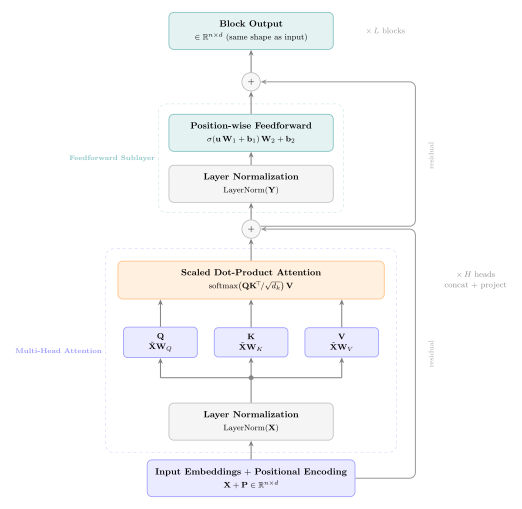

# L13c: Decoder-Only Transformers (GPT-style)
In this lecture, we build the _decoder-only_ transformer architecture used by GPT-style language models, where _GPT_ stands for _Generative Pre-trained Transformer_.  

We start from the transformer block introduced in L13a and add the two pieces that turn it into a generative language model: A _causal_ (lower-triangular) attention mask that prevents each position from attending to future tokens, and a language-modeling head that produces a probability distribution over the vocabulary at every position. 

We then assemble everything into a small decoder-only model that can be trained on raw text by next-token prediction.

> __Learning Objectives:__
>
> By the end of this lecture, you should be able to:
>
> * __Explain the role of the causal mask in autoregressive language modeling:__ Describe how the lower-triangular mask factorizes the joint distribution over a sequence into a product of conditional next-token distributions, and why this lets the model be trained on all positions of a sequence in parallel.
> * __Assemble a decoder-only language model from a transformer block:__ Combine token embeddings, positional embeddings, $L$ stacked decoder blocks, a final LayerNorm, and a linear LM head into a model that maps a sequence of token ids to a sequence of next-token logit distributions, and compute the parameter count.
> * __Sample from a trained language model:__ Apply greedy, temperature, and top-$k$ sampling to autoregressively extend a prompt, and explain the trade-off each strategy makes between repetition and diversity.

Let's get started!
___

## Example
Today, we will use the following notebook to illustrate key concepts:

> [▶ NanoGPT: a Tiny Decoder-Only LM on Tiny Shakespeare](CHEME-5820-L13c-Example-NanoGPT-Shakespeare-Spring-2026.ipynb). In this example, we train a small character-level decoder-only language model (~110k parameters, two transformer blocks, four heads) on the Tiny Shakespeare corpus and sample from it with greedy, temperature, and top-$k$ decoding. We also visualize the causal attention pattern.

___

    

      
    

## Recall: The Transformer Block from L13a
In the [L13a lecture](CHEME-5820-L13a-Lecture-Spring-2026.ipynb), we built the _transformer block_: a multi-head self-attention sublayer followed by a position-wise feedforward sublayer, each wrapped in a residual connection and a layer normalization. With input $\mathbf{X}\in\mathbb{R}^{n\times d}$, the (pre-norm) block computes:

> __Transformer Block (recap from L13a, pre-norm)__
>
> $$
\boxed{
\begin{align*}
\mathbf{Y} &= \mathbf{X} + \operatorname{MultiHead}(\operatorname{LayerNorm}(\mathbf{X})) \\
\mathbf{Z} &= \mathbf{Y} + \operatorname{FFN}(\operatorname{LayerNorm}(\mathbf{Y}))
\end{align*}}
> $$
> where multi-head attention is $H$ parallel scaled dot-product attention layers concatenated and projected back to dimension $d$, and the position-wise feedforward sublayer applies the same two-layer MLP independently to every row of its input.

The L13a block uses the standard self-attention formula
$$
\operatorname{Attention}(\mathbf{Q},\mathbf{K},\mathbf{V}) = \operatorname{softmax}\!\left(\frac{\mathbf{Q}\mathbf{K}^{\top}}{\sqrt{d_{k}}}\right)\mathbf{V},
$$
where $\mathbf{Q} = \mathbf{X}\mathbf{W}_{Q}\in\mathbb{R}^{n\times d_{k}},\mathbf{K} = \mathbf{X}\mathbf{W}_{K}\in\mathbb{R}^{n\times d_{k}},\mathbf{V} = \mathbf{X}\mathbf{W}_{V}\in\mathbb{R}^{n\times d_{v}}$ are the query, key, and value matrices computed from the input $\mathbf{X}\in\mathbb{R}^{n\times d}$ by learned linear projections. Today we make one change, we turn the self-attention mechanism into a building block for autoregressive language modeling.

> __Dimension Dictionary__
>
> _Problem-given (determined by your data and embedding):_
> * $n$ = sequence length (number of tokens in the input). Set by the input sentence or sequence you are processing.
> * $d$ = embedding dimension (width of each token vector). Set by the pretrained embedding you are using, e.g., $d = 300$ for GloVe-300d.
>
> _Design choices (hyperparameters you select):_
> * $d_{k}$ = query/key projection dimension. Controls the width of $\mathbf{Q}$ and $\mathbf{K}$.
> * $d_{v}$ = value projection dimension. Controls the width of $\mathbf{V}$ and the output of a single head.
> * $H$ = number of attention heads (introduced in the next section).
> * $d_{ff}$ = feedforward hidden dimension (introduced with the transformer block).
>
> The standard convention is $d_{k} = d_{v} = d/H$, so all design choices reduce to picking $H$. We will use this convention throughout.

### Layer Normalization
We have not formally introduced layer normalization in this course, so a brief definition:

> __Layer Normalization__
>
> Given a vector $\mathbf{z}\in\mathbb{R}^{d}$, layer normalization rescales $\mathbf{z}$ to have zero mean and unit variance across its components, then applies a learnable per-component affine transformation:
> $$
\operatorname{LayerNorm}(\mathbf{z}) = \boldsymbol{\gamma}\odot\frac{\mathbf{z} - \mu(\mathbf{z})}{\sqrt{\sigma^{2}(\mathbf{z}) + \epsilon}} + \boldsymbol{\beta}
> $$
> where $\mu(\mathbf{z}) = \tfrac{1}{d}\sum_{i=1}^{d}z_{i}$ is the per-vector mean, $\sigma^{2}(\mathbf{z}) = \tfrac{1}{d}\sum_{i=1}^{d}(z_{i} - \mu(\mathbf{z}))^{2}$ is the per-vector variance, $\boldsymbol{\gamma},\boldsymbol{\beta}\in\mathbb{R}^{d}$ are learnable per-component scale and shift parameters, $\odot$ is the element-wise product, and $\epsilon > 0$ is a small constant for numerical stability.
>
> Layer normalization is applied to each token embedding independently, so it normalizes across the embedding dimension $d$ and not across the batch or sequence dimensions, i.e., $\mathbf{z}$ is a single row of the input $\mathbf{X}\in\mathbb{R}^{n\times d}$.

___

## Causal Self-Attention
The decoder-only family is one of three transformer variants; we compare all three at the end of this lecture.

We want a model that, given the first $t-1$ tokens of a sequence, predicts the $t$-th token. For this to make sense at training time, the model's output at position $t$ must not depend on tokens at positions $t+1, t+2, \ldots, T$, otherwise the prediction would trivially see its own answer. Self-attention as written in L13a violates this requirement: every query position _attends to_ every key position, including future ones.

> __What does "attends to" mean?__
>
> "Position $i$ attends to position $j$" means the output at position $i$ depends on token $j$'s value vector, with the strength of that dependency given by the weight $\mathbf{A}_{ij}$ in the attention matrix $\mathbf{A} = \operatorname{softmax}(\mathbf{Q}\mathbf{K}^{\top}/\sqrt{d_{k}})$. If $\mathbf{A}_{ij} = 0$, position $i$ does not attend to position $j$, and information at $j$ cannot reach the output at $i$ through this sublayer.

The fix is to add a _causal mask_ that sets the attention scores at all illegal (future) positions to $-\infty$ before the softmax, so those positions receive zero attention weight.

> __Scaled Dot-Product Causal Self-Attention__
>
> Let $\mathbf{Q}, \mathbf{K}\in\mathbb{R}^{n\times d_{k}}$ and $\mathbf{V}\in\mathbb{R}^{n\times d_{v}}$ be query, key, and value matrices for a sequence of length $n$. Define the causal mask $\mathbf{M}\in\mathbb{R}^{n\times n}$ component-wise as
> $$
\mathbf{M}_{ij} = \begin{cases} 0 & \text{if } j \leq i \\ -\infty & \text{if } j > i \end{cases}
> $$
> Then causal self-attention is
> $$
\boxed{
\operatorname{CausalAttention}(\mathbf{Q},\mathbf{K},\mathbf{V}) = \operatorname{softmax}\!\left(\frac{\mathbf{Q}\mathbf{K}^{\top}}{\sqrt{d_{k}}} + \mathbf{M}\right)\mathbf{V}.
}
> $$
> Because $\exp(-\infty) = 0$, every entry $(i, j)$ with $j > i$ receives zero softmax weight, so the output row $i$ is a weighted average over only the value rows at positions $1, 2, \ldots, i$.

Visually, the mask $\mathbf{M}$ looks like this for $n = 6$:

> __Causal mask shape ($n = 6$, $0$ shown for valid entries, $\bullet$ for $-\infty$)__
>
> $$
\mathbf{M} = \begin{pmatrix}
0 & \bullet & \bullet & \bullet & \bullet & \bullet \\
0 & 0 & \bullet & \bullet & \bullet & \bullet \\
0 & 0 & 0 & \bullet & \bullet & \bullet \\
0 & 0 & 0 & 0 & \bullet & \bullet \\
0 & 0 & 0 & 0 & 0 & \bullet \\
0 & 0 & 0 & 0 & 0 & 0
\end{pmatrix}
> $$

After softmax, the attention matrix has a strict lower-triangular pattern: row 1 attends only to position 1, row 2 attends to positions 1 and 2, and so on. Row $i$ has exactly $i$ non-zero entries that sum to one.

### Why This Implements an Autoregressive Factorization
Probabilistic language models factorize the joint distribution over a sequence by the chain rule:
$$
p(x_{1}, x_{2}, \ldots, x_{T}) = \prod_{t=1}^{T} p(x_{t}\mid x_{<t})\quad\text{where } x_{<t} = (x_{1}, \ldots, x_{t-1}).
$$
A decoder-only language model represents each conditional $p(x_{t}\mid x_{<t})$ as a neural network. The crucial constraint is that the prediction at position $t$ must depend _only_ on tokens at positions $1, 2, \ldots, t-1$ (and possibly $t$ itself, depending on convention). The causal mask enforces exactly this constraint at every layer of the network: information at position $j > i$ cannot flow into position $i$ through any attention sublayer, so the model's output at position $i$ is a function of $x_{1}, \ldots, x_{i}$ only.

> __A notation warning before we proceed.__
>
> In the rest of this lecture we introduce a new symbol $V$ for the _vocabulary size_, i.e., the number of distinct tokens the model can predict. This scalar $V$ is unrelated to the value matrix $\mathbf{V}\in\mathbb{R}^{n\times d_{v}}$ that appears inside the attention formula. The two are distinguished by typeface: bold $\mathbf{V}$ always refers to the value matrix, and plain italic $V$ always refers to the vocabulary size.

> __The big payoff: parallel training.__
>
> The causal mask is what turns the sequential-looking task of next-token prediction into a single parallel forward pass. First, let's fix what we mean by "output": we feed the full sequence $\mathbf{x} = (x_{1}, \ldots, x_{T})$ into the network and get back a logits matrix $\boldsymbol{\ell}\in\mathbb{R}^{T\times V}$, where row $t$ (after softmax) is the next-token distribution at position $t$. Two facts then combine:
>
> * __One network, $T$ outputs in one forward pass:__ There is a single network shared set of weights $\theta$ for he $p(x_{t}\mid x_{<t})$ calculation, not $T$ separate networks. Every operation in the block (attention, feedforward, LayerNorm) is a matrix-on-matrix operation, so feeding in $\mathbf{X}\in\mathbb{R}^{T\times d}$ produces a $T\times d$ matrix at every layer and finally the $T\times V$ logits matrix. All $T$ rows are computed in one shot by GPU-friendly matmuls (matrix multiplications), not by $T$ separate evaluations.
> * __The mask makes each row a valid prefix-only prediction:__ Without the causal mask, row $t$ of the output would be a function of all $T$ input rows, so it would have seen the answer $x_{t+1}$ (or beyond). The mask zeros out the attention weights $p_{ij}$ for $j > i$ at every layer, which forces row $t$ to be a function of input rows $1, \ldots, t$ only. So even though the network received the whole sequence, row $t$ behaves _as if_ it had only been given the prefix $x_{1}, \ldots, x_{t}$.
>
> Together, these give $T$ legitimate prefix-conditioned predictions from a single forward pass over the full sequence. Cross-entropy losses are then summed over all $T$ rows and backpropagated in one shot, instead of running the network $T$ times sequentially.

This is a little abstract, so let's make it concrete with a small example.

> __Concrete picture ($T = 4$).__
>
> Suppose we feed the input sequence $\mathbf{x} = (x_{1}, x_{2}, x_{3}, x_{4})$ into the model, producing a logits matrix $\boldsymbol{\ell}\in\mathbb{R}^{4\times V}$. Each row of $\boldsymbol{\ell}$ is what we mean by an "output" at that position: a $V$-dimensional logit vector that becomes a distribution over the vocabulary after softmax. Because of the causal mask:
>
> | Output row | Function of input rows | Distribution it represents | Target $y_{t}$ |
> |---|---|---|---|
> | $\boldsymbol{\ell}_{1,:}$ | $x_{1}$ only | $p(\cdot \mid x_{1})$ | $x_{2}$ |
> | $\boldsymbol{\ell}_{2,:}$ | $x_{1}, x_{2}$ | $p(\cdot \mid x_{1}, x_{2})$ | $x_{3}$ |
> | $\boldsymbol{\ell}_{3,:}$ | $x_{1}, x_{2}, x_{3}$ | $p(\cdot \mid x_{1}, x_{2}, x_{3})$ | $x_{4}$ |
> | $\boldsymbol{\ell}_{4,:}$ | $x_{1}, x_{2}, x_{3}, x_{4}$ | $p(\cdot \mid x_{1}, x_{2}, x_{3}, x_{4})$ | $x_{5}$ |
>
> Same network, same weights, four predictions, one forward pass. The training loss is the sum of four cross-entropy terms, one per row, scored against the shifted targets $(x_{2}, x_{3}, x_{4}, x_{5})$.

In the rest of this lecture, the recurrent contrast is also worth keeping in mind: a recurrent language model has to step through positions one at a time during both the forward and backward passes, because the hidden state at time $t$ depends explicitly on the hidden state at time $t-1$. The causal mask replaces that explicit recurrence with a static lower-triangular attention pattern, which is what removes the sequential bottleneck and makes the GPU-friendly parallelism of self-attention compatible with the inherently sequential structure of language.
___

## The Decoder-Only Block
A _decoder-only block_ is the L13a transformer block with the multi-head self-attention sublayer replaced by its causal version.

> __Decoder-Only Block__
>
> Let $\mathbf{X}\in\mathbb{R}^{n\times d}$ be the input. The block computes:
> $$
\boxed{
\begin{align*}
\mathbf{Y} &= \mathbf{X} + \operatorname{CausalMultiHead}(\operatorname{LayerNorm}(\mathbf{X})) \\
\mathbf{Z} &= \mathbf{Y} + \operatorname{FFN}(\operatorname{LayerNorm}(\mathbf{Y}))
\end{align*}}
> $$
> where $\operatorname{CausalMultiHead}$ is multi-head attention with the causal mask applied to every head, and $\operatorname{FFN}$ is the same position-wise two-layer MLP from L13a. The residual connections and layer normalizations carry over from L13a unchanged: the residuals keep gradients well-scaled when many blocks are stacked, and the layer norms hold the activations entering each sublayer on a stable scale.

One notational point before we proceed:

> __A note on "residual."__
>
> In this context, a _residual_ refers to a _residual connection_ (or skip connection), not a regression residual. Each sublayer outputs its input plus its transformation, i.e., $\mathbf{Y} = \mathbf{X} + f(\mathbf{X})$, so the sublayer $f$ only has to learn the _difference_ between its input and its desired output (hence the name). The addition also creates a direct path for gradients to flow backward through the stack, which is what makes deep transformer stacks trainable. This idea was introduced for very deep convolutional networks in [ResNet (He et al., 2015)](https://arxiv.org/abs/1512.03385).

The block is otherwise structurally identical to L13a's transformer block, including the parameter count: $\sim 12 d^{2}$ in the dominant terms ($4 d^{2}$ for the four attention projection matrices and $8 d^{2}$ for the two feedforward weight matrices), plus linear-in-$d$ contributions from biases and layer norm parameters.
___

## Assembling a Decoder-Only Language Model
A complete GPT-style language model wraps a stack of $L$ decoder-only blocks with three more pieces: a token embedding lookup, a positional embedding, and a final language-modeling head. Let's take a look at the full architecture:

> __Decoder-Only Language Model__
>
> Let $V$ be the vocabulary size, $d$ the model dimension (embedding dimension), $L$ the number of stacked blocks, and $n_{\max}$ the maximum context length. Then, we can define the following components:
> * __Token embedding matrix__ $\mathbf{E}_{\text{tok}}\in\mathbb{R}^{V\times d}$, with rows $\mathbf{e}^{\text{tok}}_{1}, \mathbf{e}^{\text{tok}}_{2}, \ldots, \mathbf{e}^{\text{tok}}_{V}\in\mathbb{R}^{d}$. Row $\mathbf{e}^{\text{tok}}_{i}$ is the $d$-dimensional vector that represents token id $i$ (e.g., $\mathbf{e}^{\text{tok}}_{42}$ is the embedding of whichever character or word maps to id $42$). All $V\,d$ entries are learned by gradient descent jointly with the rest of the model.
> * __Positional embedding matrix__ $\mathbf{E}_{\text{pos}}\in\mathbb{R}^{n_{\max}\times d}$, with rows $\mathbf{e}^{\text{pos}}_{1}, \mathbf{e}^{\text{pos}}_{2}, \ldots, \mathbf{e}^{\text{pos}}_{n_{\max}}\in\mathbb{R}^{d}$. Row $\mathbf{e}^{\text{pos}}_{t}$ is a learned $d$-dimensional vector that tells the model "this token is at position $t$." Self-attention is permutation-invariant on its own, so without this signal the model would not know which token came first; adding $\mathbf{e}^{\text{pos}}_{t}$ to the token embedding at position $t$ is what injects order into the input.
> * __Specify $L$ decoder-only blocks__ $\mathcal{B}_{1}, \mathcal{B}_{2}, \ldots, \mathcal{B}_{L}$. Each block is the causal-attention + feedforward unit defined above. They are applied in sequence ($\mathcal{B}_{\ell}$ takes the output of $\mathcal{B}_{\ell-1}$ as input), each has its own independent set of weights, and each maps a $T\times d$ matrix to a $T\times d$ matrix. Stacking $L$ of them is what gives the model depth.
> * __Final LayerNorm__, operating on the $d$-dimensional embedding axis. Applied independently to each of the $T$ rows coming out of the last block, this normalizes the activations entering the LM head so that the logits do not blow up or collapse as $L$ grows.
> * __Language-modeling head__ $\mathbf{W}_{\text{LM}}\in\mathbb{R}^{V\times d}$, a linear projection to vocabulary logits. One row per vocabulary entry; multiplying a $d$-dimensional output vector by $\mathbf{W}_{\text{LM}}^{\top}$ produces a $V$-dimensional logit vector, one logit per candidate next token. (In many GPT-style implementations, $\mathbf{W}_{\text{LM}}$ is _tied_ to $\mathbf{E}_{\text{tok}}$, i.e., the same matrix is used for input lookup and output projection, which saves $V\,d$ parameters.)
>
> Given a sequence of token ids $\mathbf{x} = (x_{1}, x_{2}, \ldots, x_{T})$ with $T \leq n_{\max}$, the model computes, for each position $t = 1, 2, \ldots, T$,
> $$
\boxed{
\begin{align*}
\mathbf{h}^{(0)}_{t} &= \mathbf{e}^{\text{tok}}_{x_{t}} + \mathbf{e}^{\text{pos}}_{t} \quad\in\mathbb{R}^{d} \\
\mathbf{H}^{(\ell)} &= \mathcal{B}_{\ell}(\mathbf{H}^{(\ell-1)}),\quad \ell = 1, 2, \ldots, L \\
\tilde{\mathbf{H}} &= \operatorname{LayerNorm}(\mathbf{H}^{(L)}) \\
\boldsymbol{\ell}_{t} &= \mathbf{W}_{\text{LM}}\,\tilde{\mathbf{h}}_{t}\quad\in\mathbb{R}^{V}
\end{align*}}
> $$
> where $\mathbf{H}^{(0)}\in\mathbb{R}^{T\times d}$ is the matrix whose $t$-th row is $\mathbf{h}^{(0)}_{t}$, $\tilde{\mathbf{h}}_{t}$ is the $t$-th row of $\tilde{\mathbf{H}}$, and $\boldsymbol{\ell}_{t}\in\mathbb{R}^{V}$ is the unnormalized logit vector for the next-token distribution conditional on $x_{1}, \ldots, x_{t}$. Applying a softmax to $\boldsymbol{\ell}_{t}$ gives $p(x_{t+1}\mid x_{\leq t})$.

In words: at the input, position $t$ gets the sum of two learned $d$-vectors, the embedding of the token sitting there ($\mathbf{e}^{\text{tok}}_{x_{t}}$) and the embedding of the slot it occupies ($\mathbf{e}^{\text{pos}}_{t}$). Stacking these $T$ row vectors gives the input matrix $\mathbf{H}^{(0)}$, which is then passed through $L$ decoder blocks, normalized, and projected to vocabulary logits.
___

## Training: Next-Token Prediction
Training a decoder-only language model is _next-token prediction_: given a sequence of $T+1$ tokens, the model is shown the first $T$ tokens as input and asked to predict the next token at every position. The targets $\mathbf{y}$ are simply the input shifted by one position: $y_{t} = x_{t+1}$.

> __Training loss (per sequence)__
>
> Let $\mathbf{x} = (x_{1}, \ldots, x_{T})$ and $\mathbf{y} = (x_{2}, \ldots, x_{T+1})$ be an input/target pair from a corpus, and let the model produce logits $\boldsymbol{\ell}\in\mathbb{R}^{T\times V}$ as above. The cross-entropy loss for this _single_ sequence is
> $$
\boxed{
\mathcal{L}(\theta;\, \mathbf{x},\mathbf{y}) = -\frac{1}{T}\sum_{t=1}^{T}\log p_{\theta}(y_{t}\mid x_{\leq t}) = -\frac{1}{T}\sum_{t=1}^{T}\log\operatorname{softmax}(\boldsymbol{\ell}_{t})_{y_{t}}.
}
> $$
> Averaging over a batch of $B$ sequences and over all $T$ positions gives the per-token cross-entropy used to take optimizer steps.

This loss trains all $T$ next-token predictions simultaneously, which is only sound because of the causal mask.

> __Why all $T$ positions can be trained in parallel.__
>
> A single forward pass over $\mathbf{x}$ produces a valid training signal at every position $t$, because of two facts that work together:
>
> * __Causal mask bounds each prediction's inputs:__ Because of the causal mask, the prediction $p_{\theta}(y_{t}\mid x_{\leq t})$ depends only on tokens at positions $1, \ldots, t$, even though the model was given the entire sequence $\mathbf{x}$ as input. So a single forward pass over $\mathbf{x}$ produces $T$ valid (input, target) pairs at once, and the loss summed over $t$ trains the model on all of them.
> * __Teacher forcing fixes the conditioning:__ At training time, position $t$ is conditioned on the _true_ tokens at positions $1, \ldots, t-1$ rather than on the model's own (potentially wrong) past predictions. This is called _teacher forcing_, and it is what lets every position be scored against the ground-truth target in the same forward pass.
>
> Teacher forcing combined with the causal mask is what makes a single batched forward pass compute $T$ training signals at once, instead of $T$ sequential forward passes through a recurrent model.
___

## Inference: Autoregressive Sampling
At inference time, the model has no future tokens to feed itself; it has to generate them one at a time. The standard generation loop is:

> __Autoregressive generation loop__
>
> Suppose the model has been trained, so the parameters $\theta$ are fixed. Given a prompt $\mathbf{x} = (x_{1}, \ldots, x_{T_{0}})$ and a target generation length $N$:
> 1. For $t = T_{0} + 1, T_{0} + 2, \ldots, T_{0} + N$:
>    1. Form the model input from the most recent $\min(t - 1,\, n_{\max})$ tokens of the running sequence.
>    2. Run a single forward pass through the model to obtain logits $\boldsymbol{\ell}\in\mathbb{R}^{T\times V}$, where $T$ is the input length.
>    3. Take the _last row_ of $\boldsymbol{\ell}$, which is the logit vector for position $t$.
>    4. Sample one token $x_{t}$ from a distribution derived from this logit vector (see below).
>    5. Append $x_{t}$ to the running sequence and continue.

There are three standard ways to convert the logit vector at the last position into a sampled token. Each one trades off determinism against diversity in different ways.

> __Three sampling strategies__
>
> * __Greedy decoding ($\operatorname{argmax}$):__ pick the token with the largest logit. This is deterministic and reproducible, but tends to fall into repetition loops because the highest-probability continuation of "the the the" is often "the" again.
> * __Temperature sampling:__ scale the logits by $1/\tau$ for $\tau > 0$, apply softmax, and sample. Small $\tau$ (close to $0$) approaches greedy decoding; $\tau = 1$ samples from the model's natural distribution; large $\tau$ (greater than $1$) flattens the distribution and produces more random outputs.
> * __Top-$k$ sampling:__ before applying softmax, set all but the $k$ largest logits to $-\infty$, so sampling is restricted to the $k$ most likely tokens. This avoids occasional very-low-probability "junk" tokens that pure temperature sampling can produce, while still keeping diversity within the high-probability region.

In practice, temperature sampling at $\tau\approx 0.8$ combined with top-$k$ sampling at $k\approx 40$ is a reasonable default for character-level and small word-level models.

___

## Parameter Count
The total parameter count of a decoder-only model is dominated by the $L$ decoder blocks plus the embedding tables.

> __Parameter Count: Decoder-Only Language Model__
>
> Consider a decoder-only language model with vocabulary size $V$, model dimension $d$, $L$ stacked blocks, $H$ attention heads (with $d_{k} = d_{v} = d/H$), maximum context length $n_{\max}$, and feedforward dimension $d_{ff} = 4d$. Its parameters break down as:
>
> | Component | Parameter count | Notes |
> |---|---|---|
> | Token embedding $\mathbf{E}_{\text{tok}}$ | $V\,d$ | One $d$-dimensional row per vocabulary entry. |
> | Positional embedding $\mathbf{E}_{\text{pos}}$ | $n_{\max}\,d$ | One $d$-dimensional row per position slot. |
> | $L$ decoder blocks | $L\,(12\,d^{2} + 9\,d)$ | $12\,d^{2}$ from attention and feedforward weights, $9\,d$ from biases and LayerNorm parameters. |
> | Final LayerNorm | $2\,d$ | Scale and shift on the $d$-dimensional embedding axis. |
> | LM head $\mathbf{W}_{\text{LM}}$ | $V\,d$ | No bias. |
>
> Summing and keeping only the dominant terms,
> $$
\begin{align*}
N_{\text{total}} \approx 2\,V\,d + n_{\max}\,d + L\cdot 12\,d^{2}\quad\blacksquare
\end{align*}
> $$
> Two terms dominate at different scales: the embedding terms scale linearly in $V\,d$ and dominate when $V$ is much larger than $L\,d$ (a small model with a large vocabulary), while the decoder-stack term scales as $L\,d^{2}$ and dominates when the model is deep and wide (a large model with a small vocabulary).

#### Numerical Example: Tiny Shakespeare NanoGPT
For the example notebook, we use a character-level NanoGPT with $V = 65$, $d = 64$, $H = 4$, $L = 2$, $n_{\max} = 64$, and $d_{ff} = 256$:

| Component | Computation | Parameters |
|---|---|---|
| Token embedding | $65\cdot 64$ | $4{,}160$ |
| Positional embedding | $64\cdot 64$ | $4{,}096$ |
| Per block | $12\cdot 64^{2} + 9\cdot 64 = 49{,}152 + 576$ | $49{,}728$ |
| Two blocks | $2\cdot 49{,}728$ | $99{,}456$ |
| Final LayerNorm | $2\cdot 64$ | $128$ |
| LM head | $65\cdot 64$ | $4{,}160$ |
| **Total** | | **$112{,}000$** |

This is small enough to train on CPU in a few minutes and to ship as a checkpoint with the example notebook. By comparison, a single transformer block at $d = 128$ from the L13a numerical example had $197{,}760$ parameters, and modern GPT-style models are billions of parameters at $d \in \{1024, 4096, 12288\}$ with $L \in \{12, 24, 96, \ldots\}$.

> __Example: Tiny Shakespeare NanoGPT__
>
> [▶ Let's build a NanoGPT for the Tiny Shakespeare Corpus](CHEME-5820-L13c-Example-NanoGPT-Shakespeare-Spring-2026.ipynb). In this example, we build a small character-level decoder-only language model with two transformer blocks and four attention heads, train it on the Tiny Shakespeare corpus by next-token prediction, and sample from it with greedy, temperature, and top-$k$ decoding. 
___

## How Decoder-Only Compares to Other Transformer Variants
Decoder-only is one of three major transformer families. Before comparing them in a table, it is worth spelling out what each family does and what the named models in the literature refer to:

* __Encoder-only (e.g., [BERT, Devlin et al. 2018](https://arxiv.org/abs/1810.04805)):__ BERT stands for _Bidirectional Encoder Representations from Transformers_. An encoder-only model takes a sequence in and produces a sequence of contextual embeddings out, using _bidirectional_ self-attention with no causal mask, so every token can attend to every other. This is conceptually the _encoder half_ of an autoencoder (L10c): it maps an input to a representation, except instead of pairing it with a decoder that reconstructs the input, we attach a small task head (classifier, regressor, span predictor) on top of the representation and train the whole thing end-to-end. Encoder-only models are used when the goal is to _understand_ a sequence, not to generate one.
* __Encoder-decoder (e.g., [T5, Raffel et al. 2019](https://arxiv.org/abs/1910.10683); [original Vaswani et al. 2017](https://arxiv.org/abs/1706.03762)):__ T5 stands for _Text-to-Text Transfer Transformer_. These models have two stacks: a bidirectional encoder that reads the full input, and a causal decoder that generates the output one token at a time while attending to both its own past (via causal self-attention) and the encoder's output (via cross-attention). This is the natural architecture for sequence-to-sequence tasks where the input and output are distinct sequences, such as translation or summarization.
* __Decoder-only (e.g., [GPT-3, Brown et al. 2020](https://arxiv.org/abs/2005.14165)):__ A single causal decoder stack, with no separate encoder and no cross-attention. Input and output live in the same sequence, and generation proceeds by next-token prediction on the continuation of the prompt. This is the family we built in this lecture, and it is the architecture behind most modern large language models.

The table below compares the three families on the properties that distinguish them:

> __Transformer architecture variants__
>
> | Property | Encoder-Only (BERT) | Encoder-Decoder (T5, original Vaswani) | Decoder-Only (GPT) |
> |---|---|---|---|
> | Self-attention mask | None (full bidirectional) | Encoder: none. Decoder: causal | Causal |
> | Cross-attention sublayer | No | Yes (decoder attends to encoder output) | No |
> | Typical training objective | Masked language modeling | Sequence-to-sequence (translation, summarization) | Next-token prediction |
> | Generation? | No (used for classification/regression) | Yes (with the decoder) | Yes |
> | Example uses | Sentence classification, NER | Translation, summarization, instruction following | Text generation, code generation, chat |

We focus on the decoder-only family in this lecture because it is the simplest of the three (a single stack with one type of attention sublayer) and because it underpins most modern large language models. 

The encoder-only and encoder-decoder variants share most of the same building blocks; their differences are primarily in which attention masks are used where and which heads are attached to the output.

___

## Summary
A decoder-only transformer is the L13a transformer block with the self-attention sublayer made causal, stacked $L$ times, and wrapped with token and positional embeddings on the input side and a linear language-modeling head on the output side. The causal mask makes the model autoregressive, which lets it be trained by next-token prediction on raw text and sampled from autoregressively at inference time.

> __Key Takeaways:__
>
> * **Causal mask is the only architectural change:** Replacing self-attention with causal self-attention turns the L13a transformer block into a decoder-only block, with residuals, LayerNorm, multi-head attention, and the feedforward sublayer reused unchanged.
> * **Causal masking enables parallel training:** Each output position depends only on its own past, so all positions of a training sequence are predicted in a single forward pass and trained simultaneously by cross-entropy on the shifted targets.
> * **Sampling strategy controls the diversity-coherence trade-off:** Greedy decoding is reproducible but repeats, temperature sampling restores diversity, and top-$k$ sampling clips the tail of the distribution to avoid low-probability tokens.

For an applied example training a small decoder-only model on Tiny Shakespeare and sampling from it with all three strategies, see the [L13c example notebook](CHEME-5820-L13c-Example-NanoGPT-Shakespeare-Spring-2026.ipynb).
___
