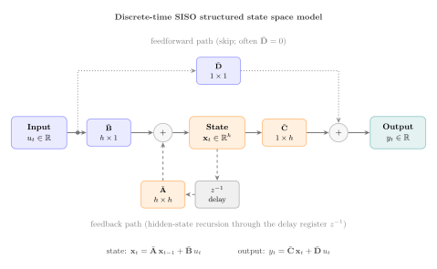

# L14a: Structured State Space Models of Long Sequences
In this lecture we introduce a different family of sequence models, the _structured state space model_ (SSM). Unlike recurrent networks, which entangle sequence memory with a nonlinear hidden state, an SSM represents memory as the state of a linear time-invariant (LTI) dynamical system whose state matrix is chosen so that its hidden state encodes an optimal polynomial approximation of the input sequence up to time $t$.

We focus on the S4-style _HiPPO-LegS_ construction for single-input single-output (SISO) systems. The state matrix $\mathbf{A}$ and input matrix $\mathbf{B}$ come from the [HiPPO framework of Gu et al. (2020)](https://arxiv.org/abs/2008.07669), the system is discretized with the bilinear transform, and the readout matrix $\mathbf{C}$ is trained by closed-form ridge regression on the rolled-out hidden states. The multi-input/multi-output (MIMO) extension is deferred to [L14c](../L14c).

> __Learning Objectives:__
>
> By the end of this lecture, you should be able to:
>
> * __Write down a discrete-time SSM and identify its four matrices:__ Starting from a continuous-time linear time-invariant state space model, produce its bilinear-discretized state and input matrices and describe the role each of the four matrices plays in the hidden-state recursion.
> * __Explain the HiPPO-LegS construction and why it is stable:__ State the LegS entries of the state and input matrices, interpret the hidden state as the coefficients of a polynomial approximation of the past input, and verify that every eigenvalue of the state matrix is strictly negative so the continuous-time system is stable.
> * __Train an SSM as a linear regression on hidden states:__ Freeze the state and input matrices, roll out the hidden-state trajectory on a training sequence, and solve for the readout row vector in closed form by ridge regression, then explain why this replaces stochastic gradient descent for this model.

Let's get started!
___

## Example
Today, we will use the following notebook to illustrate key concepts:

> [▶ Memorizing SPY with a HiPPO-LegS SSM](CHEME-5820-L14a-Example-Hippo-SSM-Spring-2026.ipynb). In this example, we build a SISO HiPPO-LegS SSM, fit the readout $\mathbf{C}$ on SPY log-growth rates from 2014-2024 by closed-form ridge regression, and evaluate the trained model on a held-out 2025 sequence. We sweep the hidden dimension $h$ to show how reconstruction fidelity scales with memory.

___

    

      
    

## Why Structured State Space Models?
Recurrent networks process sequences by evolving a nonlinear hidden state one step at a time, which makes them inherently sequential and slow to train on long sequences; vanilla self-attention, on the other hand, computes all pairwise interactions between tokens, which costs $\mathcal{O}(n^{2})$ time and memory in the sequence length $n$ and quickly becomes impractical beyond a few thousand tokens. Neither is a good fit for sequences that are tens or hundreds of thousands of steps long, such as audio waveforms, control trajectories, or high-frequency financial return series.

The [Long Range Arena benchmark of Tay et al. (2020)](https://arxiv.org/abs/2011.04006) makes this concrete: across tasks with sequence lengths from $1{,}024$ to $16{,}384$, both RNNs and attention-based models struggle to capture long-range dependencies, while structured SSMs close much of that gap with linear-in-$n$ cost.

The structured state space model replaces the nonlinear hidden state of an RNN with the state of a linear dynamical system whose $\mathbf{A}$ matrix is chosen so that the hidden state encodes, at every time $t$, the best polynomial approximation of the input history $\{u_{s}\}_{s\le t}$. Because the system is linear and time-invariant, it can be unrolled efficiently, discretized cleanly, and (as we will see) trained by ordinary ridge regression when only the readout $\mathbf{C}$ is learned.

___

## Continuous-Time LTI State Space Model
A linear time-invariant (LTI) state space model is a continuous-time dynamical system defined by four constant matrices that map an input signal to a state trajectory and then to an output signal.

> __Continuous-Time LTI SSM__
>
> Let $u:[0, T]\to\mathbb{R}^{d_{\text{in}}}$ be an input signal and let $\mathbf{x}:[0, T]\to\mathbb{R}^{h}$ be a hidden-state trajectory. The LTI SSM is the pair of equations
> $$
\boxed{
\begin{align*}
\dot{\mathbf{x}}(t) &= \mathbf{A}\,\mathbf{x}(t) + \mathbf{B}\,u(t) \\
y(t)               &= \mathbf{C}\,\mathbf{x}(t) + \mathbf{D}\,u(t)
\end{align*}}
> $$
> where $\mathbf{A}\in\mathbb{R}^{h\times h}$ is the state matrix, $\mathbf{B}\in\mathbb{R}^{h\times d_{\text{in}}}$ is the input matrix, $\mathbf{C}\in\mathbb{R}^{d_{\text{out}}\times h}$ is the readout (output) matrix, and $\mathbf{D}\in\mathbb{R}^{d_{\text{out}}\times d_{\text{in}}}$ is the feedforward matrix. The system is _time-invariant_ because the four matrices do not depend on $t$.

Before going further, we fix the dimensions once for the rest of the lecture, since every equation below depends on them.

> __Dimension Dictionary (SISO)__
>
> Today we use the single-input single-output (SISO) convention $d_{\text{in}} = d_{\text{out}} = 1$, which gives
> * $u(t), y(t) \in \mathbb{R}$ (scalar at each time step)
> * $\mathbf{x}(t) \in \mathbb{R}^{h}$
> * $\mathbf{A}\in\mathbb{R}^{h\times h}$, $\mathbf{B}\in\mathbb{R}^{h\times 1}$, $\mathbf{C}\in\mathbb{R}^{1\times h}$, $\mathbf{D}\in\mathbb{R}$
> * $h$ is the only _design choice_ we make; the others are fixed by the task.
>
> The multi-input/multi-output (MIMO) extension (with $d_{\text{in}}, d_{\text{out}} > 1$) is covered in L14c.

Two properties of LTI systems matter here. First, the system is fully determined by $(\mathbf{A}, \mathbf{B}, \mathbf{C}, \mathbf{D})$ and an initial condition $\mathbf{x}(0)$; there are no hidden nonlinearities. Second, _stability_ is controlled by the spectrum of $\mathbf{A}$: if every eigenvalue of $\mathbf{A}$ has negative real part, the unforced system $\dot{\mathbf{x}} = \mathbf{A}\mathbf{x}$ decays to zero, and the forced system has bounded response to bounded input. Choosing an $\mathbf{A}$ with this property is the _structured_ part of "structured state space model."

___

## The HiPPO Framework
The HiPPO framework (_High-order Polynomial Projection Operators_, [Gu et al. 2020](https://arxiv.org/abs/2008.07669)) picks $\mathbf{A}$ and $\mathbf{B}$ so that the hidden state $\mathbf{x}(t)$ at every time $t$ is the vector of coefficients of the best polynomial approximation of the past input $u(s)$ for $s\in[0, t]$, in a specified weighted $L^{2}$ inner product.

Concretely, fix an orthonormal basis $\{p_{0}(s), p_{1}(s), \ldots, p_{h-1}(s)\}$ for polynomials of degree $<h$ with respect to a weight $\omega(s)$ on $[0, t]$. Then the optimal approximation of the input up to time $t$ is
$$
u(s) \;\approx\; \sum_{k=0}^{h-1} x_{k}(t)\, p_{k}(s),\qquad s\in[0, t],
$$
where $x_{k}(t) = \langle u, p_{k}\rangle_{\omega}$ is the inner product of the input with the $k$-th basis polynomial on $[0, t]$. The miracle, proved in Gu et al. (2020), is that this vector of coefficients $\mathbf{x}(t) = (x_{0}(t), \ldots, x_{h-1}(t))$ satisfies a _linear_ ODE of exactly the LTI form we just wrote down, for a specific choice of $(\mathbf{A}, \mathbf{B})$ that depends only on the basis and the weight.

> __HiPPO (informal statement)__
>
> Given an orthonormal polynomial basis $\{p_{k}\}$ and a weight $\omega(s)$, the vector $\mathbf{x}(t)$ of projection coefficients of the input $u$ onto the first $h$ basis polynomials evolves as
> $$
\dot{\mathbf{x}}(t) = \mathbf{A}(t)\,\mathbf{x}(t) + \mathbf{B}(t)\,u(t),
> $$
> where $\mathbf{A}$ and $\mathbf{B}$ are determined by the basis and the weight and can be written down in closed form.

Different choices of weight give different HiPPO operators: a uniform weight on a growing window gives _LegS_ (Legendre, scaled), a uniform weight on a fixed-width window gives _LegT_, an exponentially decaying weight gives _LagT_. In the S4 family of models ([Gu, Goel, and Ré 2022](https://arxiv.org/abs/2111.00396)), the time-varying $\mathbf{A}(t), \mathbf{B}(t)$ are replaced by their time-invariant limits and used as the $(\mathbf{A}, \mathbf{B})$ of an LTI SSM. That is the construction we use today.

___

## LegS HiPPO Matrices (SISO)
The _LegS_ construction uses the scaled Legendre polynomials on the growing window $[0, t]$, which gives particularly clean entries for $\mathbf{A}$ and $\mathbf{B}$.

> __LegS HiPPO Matrices__
>
> For hidden dimension $h$ and SISO input, the LegS state matrix $\mathbf{A}\in\mathbb{R}^{h\times h}$ and input matrix $\mathbf{B}\in\mathbb{R}^{h\times 1}$ are
> $$
\boxed{
\begin{align*}
a_{ik} &= \begin{cases}
    -\sqrt{(2i+1)(2k+1)} & \text{if } i > k \\
    -(i+1)                & \text{if } i = k \\
    0                     & \text{if } i < k
\end{cases},\qquad
b_{i} = \sqrt{2i+1}
\end{align*}}
> $$
> for $i, k = 1, 2, \ldots, h$. The minus signs on the diagonal and sub-diagonal make every eigenvalue of $\mathbf{A}$ negative: because $\mathbf{A}$ is lower triangular, the eigenvalues are its diagonal entries $-2, -3, \ldots, -(h+1)$, so the continuous-time system is stable.

Three features of the LegS $\mathbf{A}$ matrix matter for what follows: its triangular structure, its invariance to time rescaling, and its approximation-error guarantee.

> __Key properties__
>
> * __Lower triangular:__ $\mathbf{A}$ has a simple lower-triangular structure, so its eigenvalues are the diagonal entries and solving linear systems in $(\mathbf{I} - \tfrac{\Delta t}{2}\mathbf{A})$ is cheap.
> * __Scale invariance:__ the LegS construction is invariant under time rescaling $t\to\alpha t$, so the same $(\mathbf{A}, \mathbf{B})$ work across time scales without retuning.
> * __Bounded approximation error:__ the polynomial-projection theory of [Gu et al. (2020)](https://arxiv.org/abs/2008.07669) gives explicit bounds on the reconstruction error as a function of $h$; increasing $h$ monotonically improves the approximation.

The helper [`build_legS_matrices(h)`](src/Compute.jl) in `src/Compute.jl` constructs $\mathbf{A}$ and $\mathbf{B}$ exactly as above for hidden dimension `h`. Because $\mathbf{A}$ is lower triangular, its eigenvalues are its diagonal entries, which are $-(i+1)$ for $i = 1, 2, \ldots, h$. Every eigenvalue has strictly negative real part, so the continuous-time LTI system is stable; Gu et al.'s paper uses the equivalent 0-based indexing convention and reports eigenvalues $\{-1, -2, \ldots, -h\}$, differing from our 1-based Julia version by an additive shift of one. The companion example notebook constructs and inspects these matrices on real data.

## Discretization: From Continuous to Discrete Time
Training and inference both use a discrete-time recursion, so we discretize the continuous-time LTI system at step size $\Delta t$. We use the _bilinear (Tustin) method_, which is second-order accurate in $\Delta t$ and preserves stability (eigenvalues in the continuous left half-plane map to discrete eigenvalues inside the unit circle).

> __Bilinear Discretization__
>
> Given continuous matrices $(\mathbf{A}, \mathbf{B})$ and step size $\Delta t > 0$, define the discrete matrices
> $$
\boxed{
\begin{align*}
\bar{\mathbf{A}} &= \left(\mathbf{I} - \tfrac{\Delta t}{2}\,\mathbf{A}\right)^{-1}\!\left(\mathbf{I} + \tfrac{\Delta t}{2}\,\mathbf{A}\right) \\
\bar{\mathbf{B}} &= \left(\mathbf{I} - \tfrac{\Delta t}{2}\,\mathbf{A}\right)^{-1}\!\left(\Delta t\,\mathbf{B}\right) \\
\bar{\mathbf{C}} &= \mathbf{C},\qquad \bar{\mathbf{D}} = \mathbf{D}
\end{align*}}
> $$
> and use them in the discrete-time recursion
> $$
\begin{align*}
\mathbf{x}_{t} &= \bar{\mathbf{A}}\,\mathbf{x}_{t-1} + \bar{\mathbf{B}}\,u_{t} \\
y_{t}         &= \bar{\mathbf{C}}\,\mathbf{x}_{t} + \bar{\mathbf{D}}\,u_{t}
\end{align*}
> $$
> starting from $\mathbf{x}_{0}\in\mathbb{R}^{h}$ (typically the zero vector).

The choice of discretization method is not just an accuracy question; it also controls whether the discrete system inherits the stability of the continuous one.

> __Why bilinear and not Euler?__
>
> Forward Euler maps continuous eigenvalues by $\lambda\to 1 + \Delta t\,\lambda$, which for LegS gives discrete eigenvalues $1 - k\Delta t$. These stay inside the unit circle only when $k\Delta t < 2$, i.e., when $h < 2/\Delta t$; for $\Delta t = 1/252$ this caps $h$ at about $504$, and for coarser sampling the cap drops quickly. The bilinear transform $\lambda\to(1 + \tfrac{\Delta t}{2}\lambda)/(1 - \tfrac{\Delta t}{2}\lambda)$ maps the left half-plane _exactly_ onto the unit disk, so a stable continuous system always yields a stable discrete system regardless of $\Delta t$.

In the example notebook we use $\Delta t = 1/252$ (one trading day), which is fixed by the sampling rate of the data. The helpers [`discretize`](src/Compute.jl) and [`build(MySisoLegSHippoModel; ...)`](src/Compute.jl) wrap the bilinear formulas above.

___

## Training: Ridge Regression on the Hidden States
The S4-LegS recipe freezes $(\bar{\mathbf{A}}, \bar{\mathbf{B}})$ at their HiPPO-initialized values and learns only the readout $\bar{\mathbf{C}}$ (and optionally the scalar $\bar{\mathbf{D}}$). Because the mapping from $\bar{\mathbf{C}}$ to the output is _linear_, the training loss is a quadratic in $\bar{\mathbf{C}}$ and has a closed-form solution: no gradient descent is required.

Let $\{u_{t}\}_{t=1}^{T}$ be a training input sequence, let $\{y_{t}\}_{t=1}^{T}$ be the corresponding target sequence, and roll out the hidden-state matrix row-by-row:
$$
\mathbf{X}\in\mathbb{R}^{T\times h},\qquad \mathbf{X}_{t,:} = \mathbf{x}_{t}^{\top}\quad\text{with}\quad \mathbf{x}_{t} = \bar{\mathbf{A}}\,\mathbf{x}_{t-1} + \bar{\mathbf{B}}\,u_{t},\;\;\mathbf{x}_{0} = \mathbf{0}.
$$

> __Training Objective and Closed-Form Solution__
>
> Set $\bar{\mathbf{D}} = 0$ so $y_{t} = \bar{\mathbf{C}}\,\mathbf{x}_{t}$, and write $\bar{\mathbf{C}}\in\mathbb{R}^{1\times h}$ as a row vector. The ridge-regression training loss is
> $$
\mathcal{L}(\bar{\mathbf{C}}) = \sum_{t=1}^{T}\left(y_{t} - \bar{\mathbf{C}}\,\mathbf{x}_{t}\right)^{2} + \lambda\,\|\bar{\mathbf{C}}\|_{2}^{2}.
> $$
> This is quadratic in $\bar{\mathbf{C}}$ and is minimized in closed form by
> $$
\boxed{\;\;\hat{\bar{\mathbf{C}}}^{\top} = \left(\mathbf{X}^{\top}\mathbf{X} + \lambda\mathbf{I}\right)^{-1}\mathbf{X}^{\top}\,\mathbf{y}.\;\;}
> $$
> where $\mathbf{y} = (y_{1}, \ldots, y_{T})^{\top}\in\mathbb{R}^{T}$ is the target vector. The ridge penalty $\lambda > 0$ is optional but useful when $h$ approaches $T$ or when $\mathbf{X}^{\top}\mathbf{X}$ is ill-conditioned; in the example we use $\lambda = 10^{-4}$.

This closed-form solution is unusual for a sequence model, so it is worth spelling out exactly why backpropagation is unnecessary here.

> __Why does this work without backpropagation?__
>
> Every operation from $u$ to $y$ except the final multiplication by $\bar{\mathbf{C}}$ is _parameter-free_ once $(\bar{\mathbf{A}}, \bar{\mathbf{B}})$ are frozen. So the hidden-state matrix $\mathbf{X}$ is a deterministic function of the input sequence and the HiPPO initialization, and the only unknowns in the loss are the $h$ entries of $\bar{\mathbf{C}}$. A quadratic loss in $h$ variables has a closed-form minimizer, and we use it. This is the same reason linear regression does not need SGD: the normal equations give the answer directly.

The ridge regression above is agnostic to the choice of target; different targets correspond to different learning tasks, and the next note summarizes the two that matter for this course.

> __Memorize vs. forecast__
>
> The choice of target $y_{t}$ is task-specific. For today's example we take $y_{t} = u_{t}$, which trains the readout to _reconstruct the current input from the hidden state_ and tests whether the LegS basis captures enough information to invert the filter. Forecasting targets like $y_{t} = u_{t+k}$ are a natural extension and are revisited in L14c.

For SISO LegS with $h = 128$ and $T \approx 2{,}766$ (eleven years of daily data), the ridge system is a $128\times 128$ linear solve that runs in a fraction of a second on CPU, replacing what would otherwise be a multi-minute SGD loop.

___

## Applied Example
Everything above is pulled together in the companion notebook, where we fit $\hat{\bar{\mathbf{C}}}$ on 2014-2024 SPY log-growth rates and evaluate on the 2025 holdout.

> __Example: HiPPO-LegS on SPY__
>
> [▶ Memorizing SPY with a HiPPO-LegS SSM](CHEME-5820-L14a-Example-Hippo-SSM-Spring-2026.ipynb). We build a SISO HiPPO-LegS model, fit $\bar{\mathbf{C}}$ on 2014-2024 SPY log-growth rates by ridge regression, sweep over hidden dimension $h$, and evaluate out-of-sample on 2025.

___

## How Structured SSMs Compare to RNNs and Transformers
Structured SSMs, recurrent networks, and self-attention all map a sequence of length $n$ to a sequence of length $n$, but they differ on every other axis that matters in practice: what the hidden state is, how training scales, and how inference is run.

> __Sequence-model families__
>
> | Property | RNN / LSTM | Transformer (self-attention) | Structured SSM (S4-LegS) |
> |---|---|---|---|
> | Hidden state | Nonlinear, learned | None (KV cache at inference) | Linear, HiPPO-initialized polynomial coefficients |
> | Training cost per sequence | $\mathcal{O}(n h^{2})$ sequential | $\mathcal{O}(n^{2} d)$ parallel | $\mathcal{O}(n h^{2})$ parallel (or $\mathcal{O}(n\log n)$ via convolution) |
> | Inference cost per token | $\mathcal{O}(h^{2})$ | $\mathcal{O}(n d)$ | $\mathcal{O}(h^{2})$ |
> | Memory scaling in $n$ | $\mathcal{O}(n)$ (BPTT) | $\mathcal{O}(n^{2})$ | $\mathcal{O}(n)$ |
> | Long-range memory | Decays with backprop horizon | Exact within window, quadratic cost | Polynomial-approximation guarantee |
> | Trainable parameters (today) | $\mathcal{O}(h^{2})$ | $\mathcal{O}(d^{2})$ per block | $h$ (only $\bar{\mathbf{C}}$) |

The SSM's linear-in-$n$ scaling and its HiPPO-backed polynomial-memory guarantee are why it outperforms both families on the [Long Range Arena](https://arxiv.org/abs/2011.04006) benchmark, particularly on sequences with $n \ge 4096$.

> __Relation to RNNs and to CNNs__
>
> The discrete-time recursion $\mathbf{x}_{t} = \bar{\mathbf{A}}\mathbf{x}_{t-1} + \bar{\mathbf{B}}u_{t}$ has exactly the form of a linear RNN, but with the crucial property that the dynamics are _linear and fixed_: there is no nonlinearity to destabilize the hidden state and no parameter in the recurrence to learn. Equivalently, the mapping from $u$ to $y$ is a _convolution_ with a kernel $k_{t} = \bar{\mathbf{C}}\,\bar{\mathbf{A}}^{t-1}\,\bar{\mathbf{B}}$, which is why S4 implementations exploit the FFT to train in $\mathcal{O}(n\log n)$ time. This _three-way equivalence_ (continuous ODE ↔ discrete-time linear RNN ↔ global convolution) is what makes structured SSMs efficient to train and fast to run.

___

## Summary
A structured state space model (SSM) replaces the nonlinear hidden state of an RNN with the state of a linear time-invariant dynamical system whose $\mathbf{A}$ matrix is HiPPO-initialized so that the hidden state encodes the best polynomial approximation of the input history. Discretizing bilinearly gives a discrete-time recursion on $(\bar{\mathbf{A}}, \bar{\mathbf{B}}, \bar{\mathbf{C}}, \bar{\mathbf{D}})$; freezing $(\bar{\mathbf{A}}, \bar{\mathbf{B}})$ at their LegS values makes the training loss quadratic in $\bar{\mathbf{C}}$ and solvable in closed form by ridge regression.

> __Key Takeaways:__
>
> * **HiPPO-LegS gives a stable, structured state matrix:** The LegS entries produce a state matrix whose eigenvalues are all strictly negative integers, so the continuous-time system is stable and the bilinear-discretized system has every pole strictly inside the unit circle.
> * **Bilinear discretization preserves stability:** The Tustin map is an exact bijection between the continuous left half-plane and the discrete unit disk, so a stable continuous SSM is always a stable discrete SSM regardless of the step size.
> * **Training the readout is a ridge regression, not an SGD loop:** With the state and input matrices frozen, the training loss is quadratic in the readout row vector, and the ridge normal equations return the optimum directly in a single linear solve.

For an applied example training a SISO HiPPO-LegS model on SPY log-growth rates and evaluating on held-out 2025 data, see the [L14a example notebook](CHEME-5820-L14a-Example-Hippo-SSM-Spring-2026.ipynb).
___
